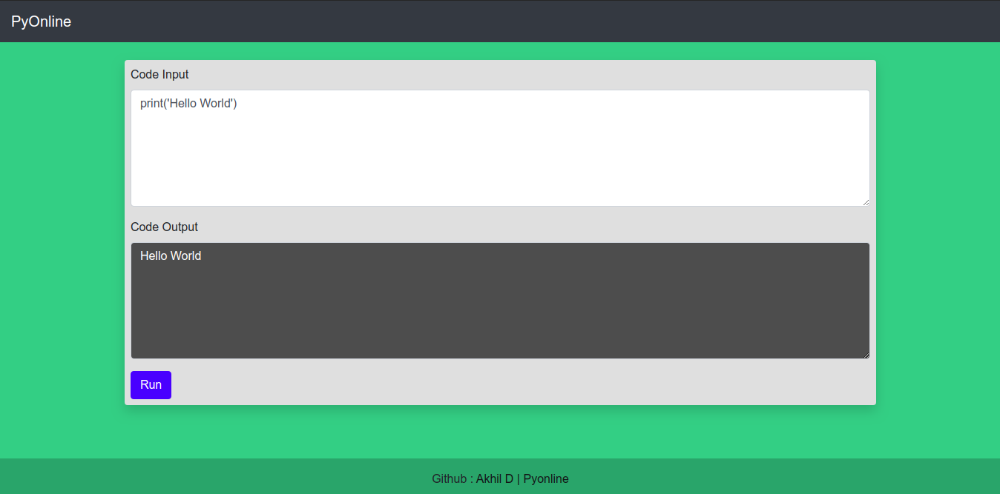

# A Python interpreter flask app.

A python interpreter built on flask used to run code your code over a broswer through a subprocess.

## How to use locally

1. Setup your local machine to have Python 3.7, lower versions will not be compatible with APIs in this project.

2. Clone code from the master branch, change to the PyOnline directory. Your machine will need to have the python3-venv package to create virtual environments. It can be installed on Linux Deb distros with :
> sudo apt-get install python3-venv

3. Create a virtual environment 'env'
> python3 -m venv env

4. Activate the virtual environment
> source env/bin/activate

5. Ensure all requirements from requirements.txt are satisfied by installing the requrements from the venv.

> pip install -r requirements.txt

6. Run the app from the PyOnline directory
> python app.py
